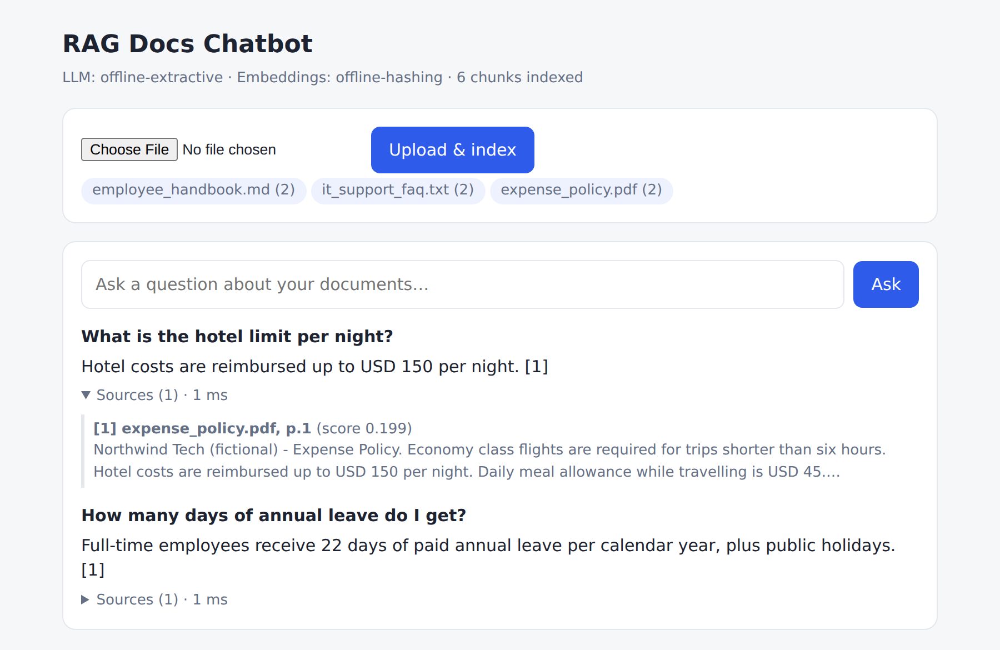

# RAG Docs Chatbot


Ask questions about your own documents (PDF, Markdown, text) and get answers that **cite the exact file and page** they came from. Built with Python, FastAPI and a retrieval-augmented generation (RAG) pipeline that works with **OpenAI**, a free local model via **Ollama**, or a fully **offline** mode that needs no API key.



## Features

- Upload PDF / `.md` / `.txt` files through a web UI or REST API
- Page-aware chunking with overlap, so every answer can be traced to a page
- Answers cite their sources (`[1]`, `[2]`); only the passages actually cited are returned
- Says *"I couldn't find that in the uploaded documents"* instead of making things up
- Swappable backends: OpenAI, Ollama (local, free) or offline
- Persistent vector index on disk (NumPy + JSON); re-uploading a file replaces its old chunks
- 15 automated tests (pytest) run on every push with GitHub Actions; Dockerfile included

## How it works

```
 Ingest:  file ──► extract text per page ──► split into overlapping chunks ──► embed ──► vector store
 Ask:     question ──► embed ──► top-k cosine search ──► prompt LLM with numbered passages ──► answer + citations
```

| File | Responsibility |
|---|---|
| `app/ingest.py` | Reads PDF/MD/TXT and splits pages into overlapping word windows |
| `app/embeddings.py` | OpenAI, Ollama or offline hashing embedder (vectors are L2-normalised) |
| `app/store.py` | Vector store: cosine search, persistence, per-document replace/delete |
| `app/llm.py` | Grounded prompt + OpenAI / Ollama / offline extractive answerer |
| `app/rag.py` | The pipeline that ties it together and filters sources to those cited |
| `app/main.py` | FastAPI endpoints and the chat UI |

## Quick start

```bash
git clone https://github.com/samSignal/rag-docs-chatbot.git
cd rag-docs-chatbot
python -m venv .venv && source .venv/bin/activate   # Windows: .venv\Scripts\activate
pip install -r requirements.txt
uvicorn app.main:app --reload
```

Open http://localhost:8000, upload a file from `sample_docs/` and ask e.g. *"How many days of annual leave do I get?"*
Interactive API docs are at http://localhost:8000/docs.

### Use a real LLM

Copy `.env.example` to `.env` and pick a backend:

```bash
# OpenAI
LLM_PROVIDER=openai
EMBED_PROVIDER=openai
OPENAI_API_KEY=sk-...

# or Ollama (free, local): install from https://ollama.com, then
#   ollama pull llama3.2 && ollama pull nomic-embed-text
LLM_PROVIDER=ollama
EMBED_PROVIDER=ollama
```

Offline mode (the default) uses a hashing embedder and an extractive answerer that quotes the best-matching sentences. It is there so the project runs and the tests pass with no key; use OpenAI or Ollama for real, paraphrased answers.

### CLI

```bash
python cli.py ingest sample_docs/
python cli.py ask "What is the hotel limit per night?"
python cli.py chat
```

### Docker

```bash
docker build -t rag-docs-chatbot .
docker run -p 8000:8000 --env-file .env rag-docs-chatbot
```

## API

| Method | Path | Description |
|---|---|---|
| `POST` | `/documents` | Upload and index a file (multipart `file`) |
| `GET` | `/documents` | List indexed documents and chunk counts |
| `DELETE` | `/documents/{name}` | Remove a document from the index |
| `POST` | `/ask` | `{"question": "..."}` → answer, cited sources, latency |
| `GET` | `/health` | Active backends and index size |

Example response:

```json
{
  "question": "What is the hotel limit per night?",
  "answer": "Hotel costs are reimbursed up to USD 150 per night. [1]",
  "sources": [{"ref": 1, "source": "expense_policy.pdf", "page": 1, "score": 0.199, "text": "..."}],
  "latency_ms": 1
}
```

## Tests

```bash
pip install -r requirements-dev.txt
pytest -q
```

Tests cover chunking, embeddings, store persistence, grounded answers with citations, refusing unanswerable questions, and the full upload → ask → delete API flow.

## Design notes

- **Chunks never cross pages**, which keeps citations exact at the cost of slightly shorter chunks on page boundaries.
- **The index records which embedding model built it**; switching models starts a fresh index instead of mixing incompatible vectors.
- **A similarity threshold (`MIN_SCORE`)** stops the LLM from being asked about irrelevant passages.
- Scanned PDFs need OCR first; the API returns a clear error when no text can be extracted.

## Possible next steps

Hybrid search (BM25 + vectors), a re-ranker, streaming responses, and a small evaluation set to measure retrieval accuracy.

## License

MIT. The documents in `sample_docs/` are about a fictional company and were written for this demo.
